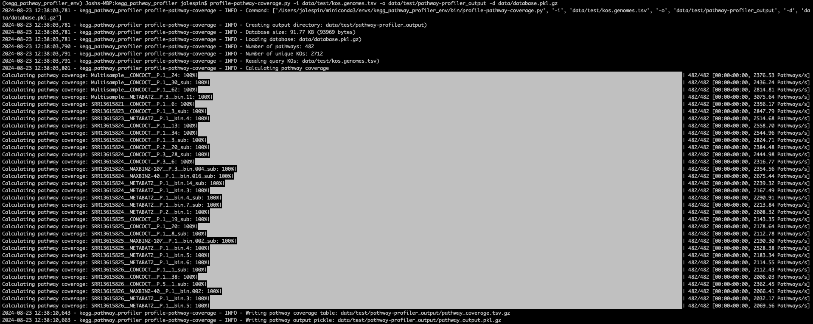
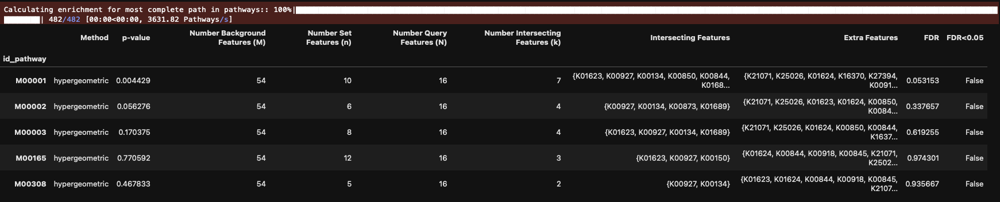

# KEGG Pathway Profiler
`KEGG Pathway Profiler` is a pathway profiling tool designed for traversing metabolic pathway graphs, identifying most complete paths based on an evaluation set of KEGG orthologs (KO), and generalized for internal usage within Python and via CLI executables.  This package is a reimplementation of [kegg-pathways-completeness-tool](https://github.com/EBI-Metagenomics/kegg-pathways-completeness-tool) (e.g., base code and theory).  

For any publications or usage, please cite the original implementation and credit the lead developer (See [Acknowledgements](#acknowledgements) below).

## Installation:

```
pip install kegg_pathway_profiler
```

## CLI Usage:

### Fetching and building the database:

**Option 1:** 
```
# Download and build the database
# Default: site-packages/kegg_pathway_profiler/data/database.pkl.gz
build-pathway-database.py \
    -d data/database.pkl.gz \ 
    --download \
```

**Option 2:**
```
# Fetch the database
mkdir -p data/
download-kegg-pathways.sh data/

# Build the database
build-pathway-database.py \
    -d data/database.pkl.gz \
    -i data/pathway_definitions.tsv \
    -n data/pathway_names.tsv \
    -c data/pathway_classes.tsv \
```

### Profile pathway coverage

#### Running:
```
profile-pathway-coverage.py -i data/test/kos.genomes.tsv -o data/test/pathway-profiler_output -d data/database.pkl.gz
```


#### Output:


## Python Usage:

### Evaluate pathway coverage
```python
import kegg_pathway_profiler as kpp
# Load Database
database = kpp.utils.read_pickle("data/database.pkl.gz")
id = "M00001"
pathway = kpp.pathways.Pathway(
                    id=id, 
                    definition=database[id]["definition"],
                    name=database[id]["name"],
                    classes=database[id]["classes"],
)
pathway
# ==================
# Pathway(id:M00001)
# ==================
# Properties:
#     - name: Glycolysis (Embden-Meyerhof pathway), glucose => pyruvate
#     - classes: Pathway modules; Carbohydrate metabolism; Central carbohydrate metabolism
#     - number_of_kos: 32
# Definition:
#     (K00844,K12407,K00845,K25026,K00886,K08074,K00918) (K01810,K06859,K13810,K15916) (K00850,K16370,K21071,K00918) (K01623,K01624,K11645,K16305,K16306) K01803 ((K00134,K00150) K00927,K11389) (K01834,K15633,K15634,K15635) (K01689,K27394) (K00873,K12406)

# Evaluate
evaluation_kos = {'K00134',
 'K00150',
 'K00844',
 'K00845',
 'K00850',
 'K00873',
 'K00886',
 'K00918',
 'K00927',
 'K01623',
 'K01624',
 'K01689',
 'K16370',
 'K21071',
 'K25026',
 'K27394',
}
results = pathway.evaluate(evaluation_kos)

# Get coverage only
results["coverage"]
# 0.6666666666666667

# Get most complete path KOs
results["most_complete_path"]
# ['K00844',
#  'K01810',
#  'K00850',
#  'K01623',
#  'K01803',
#  'K00134',
#  'K00927',
#  'K01834',
#  'K01689',
#  'K00873']

```

### Most complete path set enrichment (e.g., step enrichment)

```python
df_enrichment = kpp.enrichment.unweighted_pathway_enrichment_wrapper(
    evaluation_kos=evaluation_kos, 
    database=database,
    background_set=None,
)
```



## Documentation: 

### profile-pathway-coverage.py
```
usage: profile-pathway-coverage.py 

    Running: profile-pathway-coverage.py v3.13.11 via Python v/Users/jolespin/miniforge3/envs/kegg-dev/bin/python3.13 | profile-pathway-coverage.py

options:
  -h, --help            show this help message and exit

I/O arguments:
  -i, --kos KOS         path/to/kos.list[.gz].  Can either be 1 KO per line or a tab-separated table with the following structure: [id_genome]<tab>[id_ko], No header.
  -n, --name NAME       Name of genome. [Default: Filename for --kos]
  -o, --output_directory OUTPUT_DIRECTORY
                        path/to/output_directory/ (e.g., kegg_pathway_profiler_output/]
  -d, --database DATABASE
                        path/to/database.pkl[.gz] [Default: /Users/jolespin/miniforge3/envs/kegg-dev/lib/python3.13/site-packages/kegg_pathway_profiler/data/database.pkl.gz]
  --index_name INDEX_NAME
                        Index name for coverage table (e.g., id_genome, id_genome_cluster, id_contig) [Default: id_genome]

Utility arguments:
  -p, --n_jobs N_JOBS   Number of threads to use.  Use -1 for all available. [Default: 1]
```

### build-pathway-database.py
```
usage: build-pathway-database.py

    Running: build-pathway-database.py v3.10.14 via Python v/Users/jolespin/miniconda3/envs/kegg_pathway_profiler_env/bin/python3.10 | build-pathway-database.py

options:
  -h, --help            show this help message and exit

Local arguments:
  -d DATABASE, --database DATABASE
                        path/to/database.pkl[.gz] [Default: /Users/jolespin/miniconda3/envs/kegg_pathway_profiler_env/lib/python3.10/site-packages/kegg_pathway_profiler/data/database.pkl.gz]
  -V DATABASE_VERSION, --database_version DATABASE_VERSION
                        Database version: Adds version information to the following file: path/to/database.version where .pkl extensions are removed [Default: KEGG_v2024.8.23]
  -f, --force           If file exists, then remove file and update it.

Local arguments:
  -i PATHWAY_DEFINITIONS, --pathway_definitions PATHWAY_DEFINITIONS
                        path/to/pathway_definitions.tsv.  [id_pathway]<tab>[definition], No header.
  -n PATHWAY_NAMES, --pathway_names PATHWAY_NAMES
                        path/to/pathway_names.tsv  [id_pathway]<tab>[name], No header.
  -c PATHWAY_CLASSES, --pathway_classes PATHWAY_CLASSES
                        path/to/pathway_classes.tsv.  [id_pathway]<tab>[class], No header.

Download arguments:
  --download            Download directly from http://rest.kegg.jp/
  --intermediate_directory INTERMEDIATE_DIRECTORY
                        Write the intermediate files from http://rest.kegg.jp/ to a directory.  If 'auto' then download to the directory that contains --database called `pathway_data`.
  --no_intermediate_files
                        Don't write intermediate files
```
## Database: 
Python dictionary pickle where keys are KEGG modules and values are a dictionary of values.  

### Preview:
```json
{
    'M00001': {
        'name': 'Glycolysis (Embden-Meyerhof pathway), glucose => pyruvate',
        'definition': (
            '(K00844,K12407,K00845,K25026,K00886,K08074,K00918) '
            '(K01810,K06859,K13810,K15916) '
            '(K00850,K16370,K21071,K00918) '
            '(K01623,K01624,K11645,K16305,K16306) '
            'K01803 ((K00134,K00150) K00927,K11389) '
            '(K01834,K15633,K15634,K15635) '
            '(K01689,K27394) '
            '(K00873,K12406)'
        ),
        'classes': 'Pathway modules; Carbohydrate metabolism; Central carbohydrate metabolism',
        'graph': <networkx.classes.multidigraph.MultiDiGraph object at 0x132d2a9e0>,
        'ko_to_nodes': {
            'K00844': [[0, 2]],
            'K12407': [[0, 2]],
            'K00845': [[0, 2]],
            'K25026': [[0, 2]],
            'K00886': [[0, 2]],
            'K08074': [[0, 2]],
            'K00918': [[0, 2], [3, 4]],
            'K01810': [[2, 3]],
            'K06859': [[2, 3]],
            'K13810': [[2, 3]],
            'K15916': [[2, 3]],
            'K00850': [[3, 4]],
            'K16370': [[3, 4]],
            'K21071': [[3, 4]],
            'K01623': [[4, 5]],
            'K01624': [[4, 5]],
            'K11645': [[4, 5]],
            'K16305': [[4, 5]],
            'K16306': [[4, 5]],
            'K01803': [[5, 6]],
            'K00134': [[6, 8]],
            'K00150': [[6, 8]],
            'K00927': [[8, 7]],
            'K11389': [[6, 7]],
            'K01834': [[7, 9]],
            'K15633': [[7, 9]],
            'K15634': [[7, 9]],
            'K15635': [[7, 9]],
            'K01689': [[9, 10]],
            'K27394': [[9, 10]],
            'K00873': [[10, 1]],
            'K12406': [[10, 1]]
        },
        'optional_kos': set()
    },
    'M00002': {
        'name': 'Glycolysis, core module involving three-carbon compounds',
        'definition': (
            'K01803 ((K00134,K00150) K00927,K11389) '
            '(K01834,K15633,K15634,K15635) '
            '(K01689,K27394) '
            '(K00873,K12406)'
        ),
        'classes': 'Pathway modules; Carbohydrate metabolism; Central carbohydrate metabolism',
        'graph': <networkx.classes.multidigraph.MultiDiGraph object at 0x10d51b160>,
        'ko_to_nodes': {
            'K01803': [[0, 2]],
            'K00134': [[2, 4]],
            'K00150': [[2, 4]],
            'K00927': [[4, 3]],
            'K11389': [[2, 3]],
            'K01834': [[3, 5]],
            'K15633': [[3, 5]],
            'K15634': [[3, 5]],
            'K15635': [[3, 5]],
            'K01689': [[5, 6]],
            'K27394': [[5, 6]],
            'K00873': [[6, 1]],
            'K12406': [[6, 1]]
        },
        'optional_kos': set()
    },
    ...
}
```

## Acknowledgements: 
[Ekaterina Sakharova](https://github.com/KateSakharova) the developer for the original implementation [kegg-pathways-completeness-tool](https://github.com/EBI-Metagenomics/kegg-pathways-completeness-tool).
